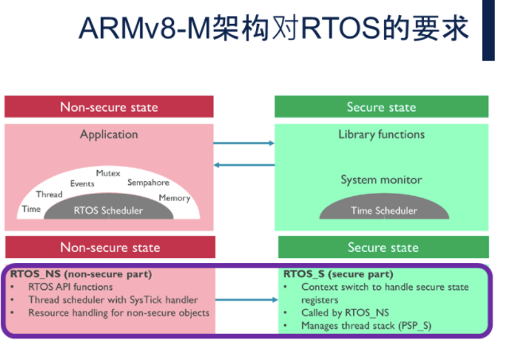

# ARM Trustzone For Cortex-M

## 简介

ARM TrustZone® 技术是系统范围的安全方法，针对高性能计算平台上的大量应用，包括安全支付、数字版权管理数字版权管理、企业服务和基于 Web 的服务。

适用于 Arm Cortex-M 处理器的 TrustZone 技术可在所有成本点为物联网设备提供强大的保护水平。该技术通过将关键的安全固件、资产和私人信息与应用程序的其余部分隔离开来，降低了攻击的可能性。它为基于平台安全架构 (PSA) 指南建立设备信任根提供了完美的起点。本篇文章以 STM32U5 为例，探究一下 TrustZone 技术在安全方面的应用。

## 系统安全

STM32U5 是一颗主打低功耗和安全应用的 MCU，它的安全特性，从各个方面都比以往的 STM32 系列有了进一步提高。

- 它支持安全启动，这是信任链的可靠锚点：bootlock 可以保证启动的唯一入口，HDP 可以将用户闪存的一部分隐藏起来，通常是复位后运行的安全启动代码，使得其对后面的用户应用程序不可见。
- 为了支持 CM33 内核里的 trustzone 安全扩展，U5 上的外设模块、存储模块都做了升级来配合 trustzone 机制
- 为了实现对软件和数据的保护，U5 新增了配合 trustzone 的安全调试功能，可以限制用户仅能调试非安全世界代码，而无法调试安全世界的代码。另外，U5 还有一个 OTFDEC 模块，可以对存储在芯片外 Ocot-SPI flash 上的密文数据或者密文代码，on the fly 地解密执行和解密读取，从而解放了片上闪存空间对用户代码的限制，同时还能保证用户代码的机密性。


**TrustZone 的基本原则，就是把应用中的关键操作代码，和其他应用程序隔离开来，避免恶意应用程序的攻击，或者由于应用程序本身的设计漏洞，对敏感操作代码的攻击 **。


## 特点和优势

- 灵活的基础

  TrustZone 为系统范围的安全性和创建受信任的平台奠定了基础。系统的任何部分都可以设计为安全世界的一部分，包括调试、外设、中断和存储器。

- 简化的安全设计

  TrustZone 允许 SoC 设计人员从一系列组件中进行选择，这些组件在安全环境中实现特定功能。TrustZone 由 Corstone 参考包支持，可帮助公司更快地开发系统。

- 友好型用户设计

  开发人员可以使用熟悉的语言创建 TrustZone 系统，同时保持现有程序员的模型。此外，TrustZone 还由 RTOS、编译器、调试和跟踪解决方案组成的综合生态系统提供支持。

## 系统启动

当芯片上电后，从上电到执行第一个非安全世界应用时，芯片内的处理流程：

## Arm TrustZone 安全架构

### Secure/Non-Secure 安全划分

在 Cortex-M33 中，如果选配了 TrustZone 技术，则 4G 的内存空间将被划分为安全和非安全内存区域。安全内存空间又可以进一步划分为两种类型： Secure 和 Non-secure Callable（NSC）。


三种内存区域的特性：

- Secure：安全数据只可以被安全代码访问，安全代码只有在内核处于安全模式时才可以被执行。
- Non-secure：非安全数据可以被安全和非安全状态访问，但非安全代码只能在内核处于非安全状态时被执行。
- Non-secure Callable(NSC)：NSC 区域作为非安全函数访问安全函数的跳板。非安全代码需要先跳转到 NSC 区域中，执行 SG 指令，然后再跳转到相应的的安全函数处执行，这也是 NS 代码访问 S 函数的唯一方式。

引入 NSC 存储区的原因，是为了防止其他二进制数据（例如，具有与 SG 指令的操作码相同的值的查找表）被用作安全状态的入口函数。

### 内存区域的的安全属性定义

内存区域的安全属性是由 Secure Attribution Unit(SAU) 和 Implementation Defined Attribution Unit(IDAU) 共同决定的，用于分离安全区和非安全区。两者最大的区别是 SAU 位于 CPU 内部，IDAU 在 CPU 外部，IDAU 不可配置。

当 IDAU 和 SAU 定义同一块内存的安全属性时，CPU 会选择两者中较高的安全属性作为此块内存最终的安全属性，最高的安全属性是 Secure，其次是 Non-Secure Callable，最后是 Non-secure。


### GTZC

STM32L5、STM32U5 新增了硬件模块 GTZC；Global TrustZone Controller (GTZC)：全局 TZ 控制器，由三个子模块组成：


- TZSC: TrustZone security controller

  此子模块定义了从外设的安全 / 特权状态。 它也控制水印内存外设控制器的子区域大小和属性  (MPCWM)。 TZSC 通知一些外设 (如 RCC、GPIO) 关于每个安全外设的安全状态，通过与 RCC 和 I/O 逻辑共享。

- MPCBB: memory protection controller - block based

  此子模块配置信任区系统产品中的内部 RAM，该产品具有分段 SRAM（512 字节页），具有可编程安全性和特权属性。

- TZIC: TrustZone illegal access controller

  此子模块收集系统中的所有非法访问事件，并生成安全中断到 NVIC 。

### 状态切换

- 从安全世界切换到非安全世界
- 从非安全世界切换到安全世界


- SG指令	：用于从非安全状态切换到安全状态，是从非安全区跳转到NSC区域之后执行的第一条指令。
- BXNS指令: 用于从安全状态返回到非安全状态。
- BLXNS指令: 用于在安全状态下调用非安全函数。

### 中断切换

中断的话呢，和原来的中断模型一样，被打断执行的程序，当前执行上下文，即通用寄存器，还有PSR之类的内核寄存器，被硬件入栈。因为是异步的中断，不是软件去调用，所以不会像前个胶片讲的，软件，即编译器去产生那些入栈的指令；硬件，由于是异步发生的，所以入栈必定是由硬件来完成。说到入栈，和以前一样，不论是安全世界还是非安全世界，都有各自的MSP和PSP堆栈，当前使用哪个堆栈，取决于CPU在当前世界的处理器模式，是handler还是thread。

除了硬件自动入栈和以前一样，考虑到安全世界被非安全世界中断打断时，跳转过去不能泄露了安全世界的执行上下文环境，还会硬件清零通用寄存器和PSR之类的内核寄存器值。

一句话小结：以中断方式在两个世界间切换，是通过硬件入栈执行上下文，并条件性地清零寄存器现场 来完成的。条件性就是指，从安全切到非安全才需要清零；非安全到安全，不需要。

## 软件设计

### CMSE

The Cortex-M Security Extensions (CMSE) 是对安全扩展（架构内在函数和选项）的编译器支持，并且是 Arm C 语言 (ACLE) 规范的一部分。

开发在安全状态下运行的软件时需要 CMSE 功能。这提供了定义安全入口点的机制，并使工具链能够在程序映像中生成正确的指令或支持功能。

使用各种属性和内在函数访问 CMSE 功能。附加的宏也被定义为 CMSE 的一部分。

- cmse_nonsecure_entry ： 可以被非安全函数调用的安全函数
- cmse_nonsecure_call     ：可以被安全函数调用的非安全函数

#### 非安全世界调用安全世界函数

```c
#if defined ( __ICCARM__ )
#  define CMSE_NS_ENTRY __cmse_nonsecure_entry
#else
#  define CMSE_NS_ENTRY __attribute((cmse_nonsecure_entry))
#endif

CMSE_NS_ENTRY uint32_t nsc_function(void)
{
	return 0;
}
```

#### 安全世界调用非安全世界函数

```c
/**
 * @brief typedef for non-secure callback.
 */
typedef void (*non_secure_callback )(void) __attribute__((cmse_nonsecure_call));

void nsc_function(void * callback_func)
{
    non_secure_callback non_secure_cb_func;

    /* Return function pointer with cleared LSB. */
    non_secure_cb_func = (non_secure_callback) cmse_nsfptr_create(callback_func);

    /* Invoke the supplied callback. */
    non_secure_cb_func();
}
```

## 存储隔离

### SRAM

SRAM自己没有配置自己哪些部分是安全区域，哪些部分是非安全区域的能力，因此它需要GTZC的帮助。具体依赖的就是GTZC中刚才介绍的第一个子模块，MPCBB。

片上flash，一直是按照flash page组织的，L5上是2K一个page，或者4K一个page，取决于当前flash是双bank还是单bank模式。

SRAM现在为了设置安全部分区域，也特意逻辑上划分出256字节为单位的一个个block。通过MPCBB寄存器组，可以对这些SRAM上的block做独立的安全属性配置。

寄存器复位值，每个位域都是1，表示对应的block是安全的。

SRAM就是一个典型的securable的外设，通过GTZC的MPCBB子模块来配置其区域的安全性。

另外应该可以提到的应该是SRAM的访问控制属性，S的区域可以被什么样的transaction访问，NS的区域可以被什么样的transaction访问，以及可以通过寄存器设置允许S transaction访问NS的SRAM区域

### FLASH

片上Flash memory是TZ aware的外设，因此它有相关的寄存器来配置自己的访问安全属性。除此之外，它甚至还有选项字节的配置，可以使得预定义的安全属性在上电即生效。Flash通过选项字节，提供water mark方式的配置，可以标出哪一段区域是安全的。还可以同时标出哪一段区域是用户程序不可见的隐藏区域。对于一个virgin的STM32L5芯片，使能了TZ安全扩展后，SECWM这个选项字节的默认状态是全片都是安全的。

用户配置SECWM，指定出安全和不安全的区域，以及HDP用户不可见区。这个配置apply到系统后，下次上电就生效。上电后，用户还可以通过寄存器SECBB来以page为粒度，精细地对安全区域和非安全区域再做调整，如图所示。然后按照两种设置叠加，取安全等级高的原则，最后得到用户flash的安全配置，如最右边的图示。

Flash的各个page被最终配置好安全属性后，在安全扇区的操作，和非安全扇区的操作，就依据两套不同的控制寄存器和状态位来完成了。非安全区域上的flash操作，产生的中断连到Flash这条NVIC线上；安全区域上的flash操作，对应中断连到Flash_S这条NVIC中断线上。

这就是一个典型的TZ aware IP，无需GTZC的帮助，自己可以配置自己哪些部分是安全transaction可以访问，哪些部分只能非安全transaction访问。

## 外设隔离

Cortex-M33 的外设可以设置为安全或者非安全属性。

### GPIO

复位后，所有GPIO的引脚都是安全的，可通过寄存器SECCFGR（secure configure register）对每个引脚的安全性单独配置。

### UART

UART和SRAM一样，不是TZ aware的IP，需要通过GTZC这个大管家帮自己设置TZ安全属性。而和SRAM不同之处在于，第一，SRAM是通过GTZC的第一个子模块MPCBB来配置的，UART是通过GTZC的第二个子模块TZSC来配置的；第二，SRAM内部可以有些区域是安全的，有些区域是非安全的，所谓“BB”, block based，而UART要么all in， 要么all out，它的安全属性是贯穿在整个UART模块上，不会是某些部分，比如发送逻辑安全的，接收逻辑处于非安全配置中。通过GTZC_TZSC_SecureConfigureRegister也可以看出来，每个uart，都是整体配置成安全或者非安全。

### 中断

在非安全世界中使用中断，需要在安全世界初始化时，使能寄存器 `NVIC->ITNS`，使中断处于非安全世界。否则非安全世界中断无法响应。

## RTOS



## 参考链接

- [TrustZone for Cortex-M – Arm®](https://www.arm.com/technologies/trustzone-for-cortex-m)

  
